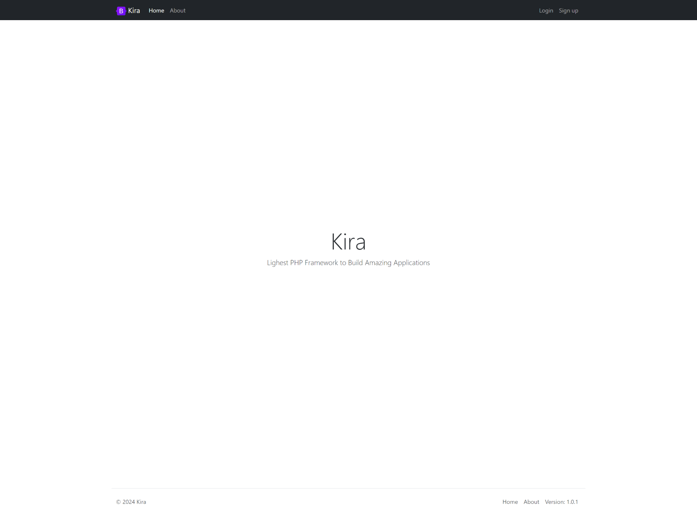

# Welcome to Kira



This is a [beginner's PHP Framework](https://kevinurielfonseca.me/kiraframework/docs) project made purely from scratch!.

## Getting Started

- Visit our [Learn Kira](https://kevinurielfonseca.me/kiraframework/learn) course to get started with Kira.
- Visit the [Kira Showcase](https://kevinurielfonseca.me/kiraframework/showcase) to see more sites built with Kira.

## Installation

You will need to set your document root to the `public` directory. Here are some instructions for setting the document root for XAMPP:

**XAMPP**
If you are using XAMPP, you can set the document root in the `httpd.conf` file. Here is an example:

```
DocumentRoot "C:/xampp/htdocs/kira/public"
<Directory "C:/xampp/htdocs/kira/public">
</Directory>
```

**SET YOUR DB INFORMATION**
Access the `.env` file within the root folder (you might need to create it), in there you will find all the variables that you can customize according to your liking. Otherwise simply copy and paste the following variables.

```
DB_HOST=""
DB_PORT=""
DB_NAME=""
DB_USERNAME=""
DB_PASSWORD=""
```

## FIRST STEP

```
app/*** contains all the models, views and controllers (this is what you work with as web developer).
kira/*** contains all the framework files (this is what you work with if you want to create/modify this framework).
public/*** Don't touch the index.php file, that's like the entry point where everything gathers together to make it work!. You ONLY touch the css and javascript folders!. Ignore the `.htaccess`.
resources/*** Contains the entry point for a SQL database
```

The rest of the files such as the routes.php in the root folder controls what is visible in the browser. This could be moved within the app folder, however, I wanted to keep it simple and easy to reach!. The helpers file, include some of the functions required to make it work, not as important but help a lot.

## Documentation

Visit [https://kevinurielfonseca.me/kiraframework/docs](https://kevinurielfonseca.me/kiraframework/docs) to view the full documentation.

## Community

The Kira community can be found on [GitHub Discussions](https://github.com/kirasiris/kiraframework/discussions) where you can ask questions, voice ideas, and share your projects with other people.

To chat with other community members you can join the Kira [Discord](https://kevinurielfonseca.me/discord) server.

Do note that our [Code of Conduct](https://github.com/kirasiris/kiraframework/blob/main/CODE_OF_CONDUCT.md) applies to all Kira community channels. Users are **highly encouraged** to read and adhere to them to avoid repercussions.

## Contributing

Contributions to Kira are welcome and highly appreciated. However, before you jump right into it, we would like you to review our [Contribution Guidelines](/contributing.md) to make sure you have a smooth experience contributing to Kira.

### Good First Issues:

We have a list of **[good first issues](https://github.com/kirasiris/kiraframework/labels/good%20first%20issue)** that contain bugs that have a relatively limited scope. This is a great place for newcomers and beginners alike to get started, gain experience, and get familiar with our contribution process.

## Kira Author

- Kevin Fonseca ([@kirasiris](https://github.com/kirasiris))

## Kira Authors

A list of the original co-authors of Kira that helped bring this amazing website to life!

- Kevin Fonseca ([@kirasiris](https://github.com/kirasiris))

---

## Security

If you believe you have found a security vulnerability in Kira, I encourage you to **_responsibly disclose this and NOT open a public issue_**.

I will investigate all legitimate reports. and do my best to quickly fix the problem.

Email `kebin1421@hotmail.com` to disclose any security vulnerabilities.

Alternatively, you can visit this [link](https://kevinurielfonseca.me/security) to know more about Kira security
